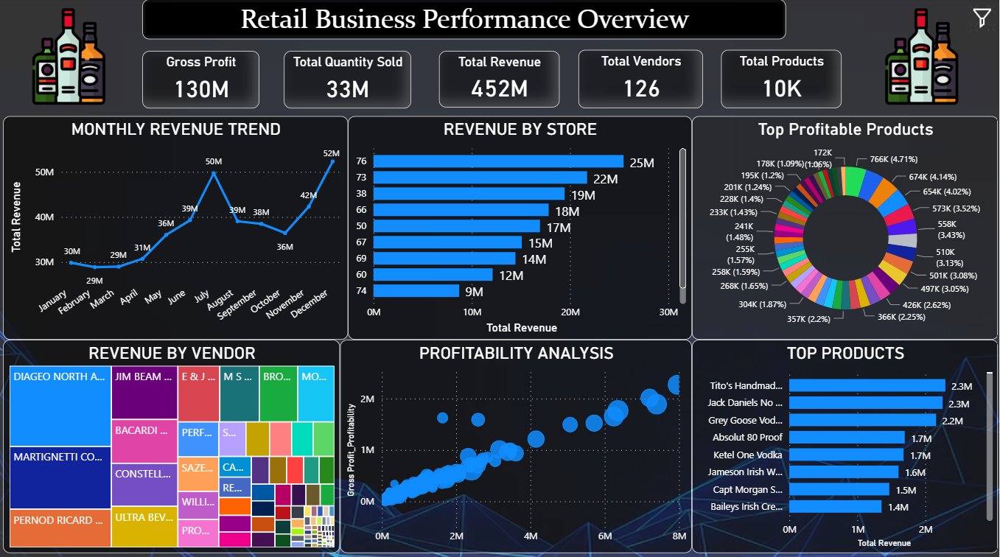
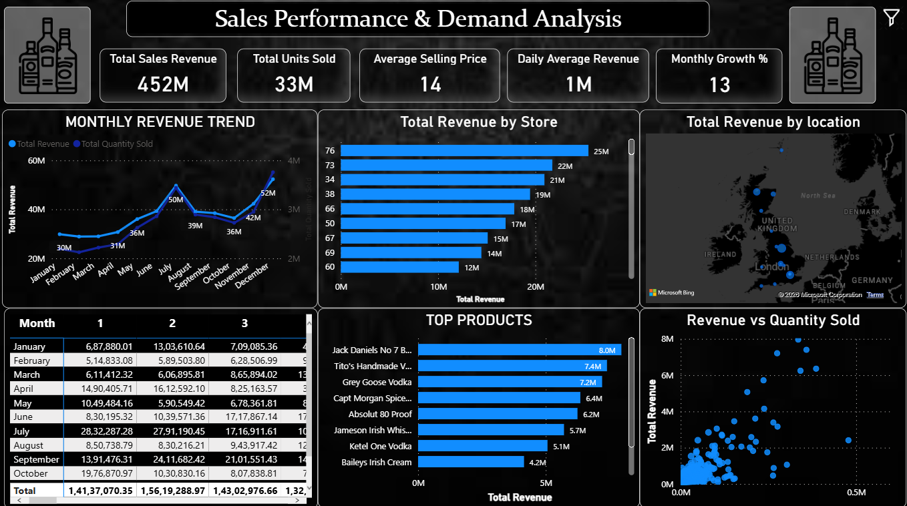
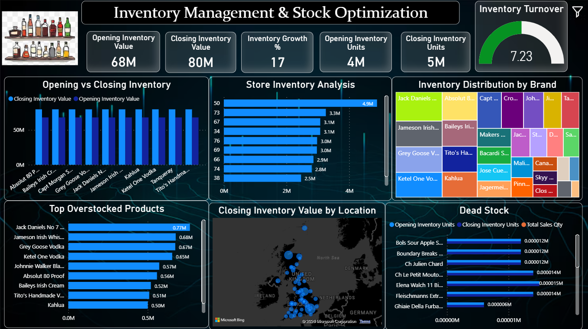
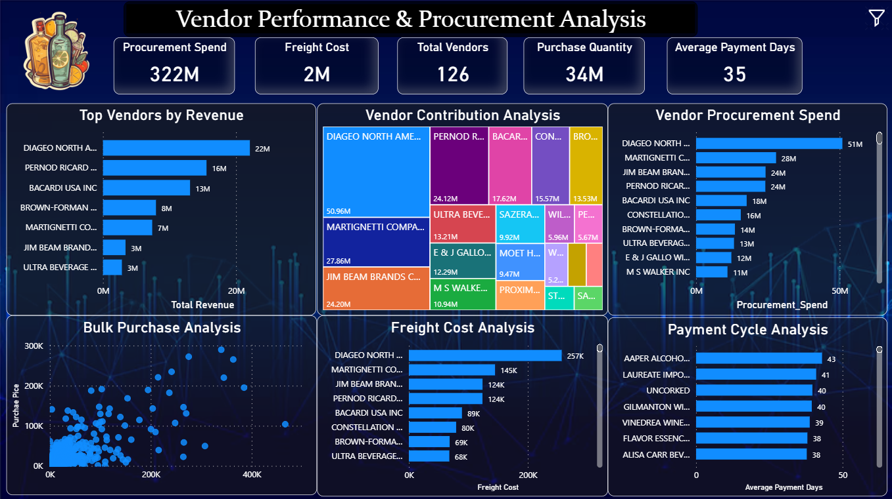
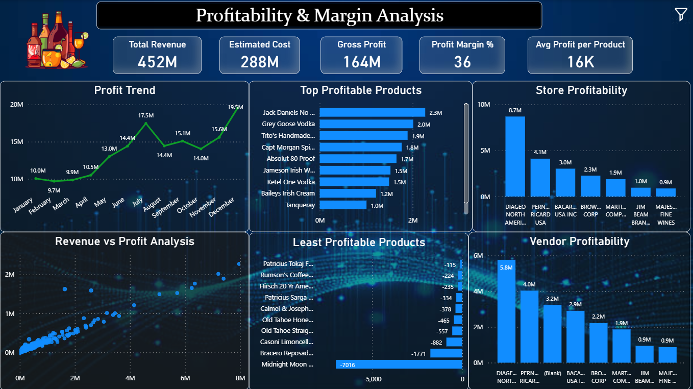

# 🏪 Inventory · Procurement · Sales · Business Intelligence Platform

<div align="center">


**End-to-End Business Intelligence & Data Analytics Solution**  
*Retail | Supply Chain | Procurement | Profitability | Inventory Management*

</div>

---

## 📌 Project Summary

> A full-scale **Business Intelligence platform** built on **15.6 million+ transaction records** across 6 datasets — covering the complete retail supply chain from **vendor procurement → inventory management → sales → profitability analysis**.

This project simulates a real-world **data analyst / business analyst** workflow:
- Raw data ingestion and cleaning
- Exploratory data analysis (EDA) across all business functions
- SQL-based data modelling and views
- Advanced analytics (ABC analysis, Pareto, Inventory Turnover, Vendor Dependency)
- Interactive **Power BI dashboards** for executive and operational reporting

---

## 📊 Business Impact at a Glance

| Metric | Value |
|---|---|
| 💰 Total Sales Revenue Analysed | **$452 Million** |
| 📦 Total Units Sold | **32.9 Million** |
| 📈 Gross Profit Identified | **$130 Million** |
| 🏬 Stores Covered | **80 Stores** |
| 🛍️ Products (SKUs) | **10,182 Products** |
| 🤝 Vendors | **129 Vendors** |
| 📋 Total Records Processed | **15.6 Million Rows** |
| 📁 Datasets Used | **6 Datasets** |

---

## 🗂️ Dataset Overview

| Dataset | Records | Type | Description |
|---|---|---|---|
| `begin_inventory.csv` | 206,529 | Snapshot | Opening stock at period start |
| `end_inventory.csv` | 224,489 | Snapshot | Closing stock at period end |
| `purchase_prices.csv` | 12,261 | Dimension / Master | Vendor pricing & product master data |
| `purchases.csv` | 2,372,474 | Fact Table | All procurement transactions |
| `sales.csv` | 12,825,363 | Fact Table | All sales transactions (primary revenue table) |
| `vendor_invoice.csv` | 12,261 | Financial | Vendor invoices, freight & payment tracking |

**Business Flow Covered:**
```
Vendor → Purchase Order → Inventory Stock → Sales → Gross Profit → Vendor Payment
```

---

## 🔑 Key Features Engineered

| Category | Derived Features |
|---|---|
| **Inventory** | Inventory Value, Average Inventory, Inventory Turnover Ratio, Dead Stock Flags |
| **Sales** | Daily/Monthly Revenue, Revenue Growth Rate, Seasonal Demand Index |
| **Profitability** | Gross Profit, Profit Margin %, Loss-Making SKU Flags |
| **Vendor** | Lead Time, Payment Delay Days, Vendor Contribution %, Freight-to-Spend Ratio |

---

## 📁 Project Structure

```
Retail-Inventory-Sales-Analytics/
│
├── 📂 data/
│   ├── raw/                    ← Original source datasets (6 CSV files)
│   ├── cleaned/                ← Post-cleaning datasets
│   └── processed/              ← Aggregated summary files
│
├── 📓 notebooks/
│   ├── 01_data_cleaning.ipynb
│   ├── 02_eda_inventory_analysis.ipynb
│   ├── 03_sales_analysis.ipynb
│   ├── 04_vendor_analysis.ipynb
│   ├── 05_profitability_analysis.ipynb
│   └── 06_advanced_analysis.ipynb
│
├── 🗄️ sql/
│   ├── schema/                 ← Table creation & relationships
│   ├── analysis/               ← Inventory, sales, vendor, profitability queries
│   └── views/                  ← Reusable SQL views for reporting
│
├── 📊 powerbi/
│   ├── Retail_Inventory_Analytics.pbix
│   └── screenshots/            ← Dashboard preview images
│
├── 📄 reports/
│   ├── business_insights.pdf
│   ├── project_presentation.pptx
│   └── final_report.docx
│
├── requirements.txt
└── README.md
```

---

## 📓 Notebooks Walkthrough

### `01_data_cleaning.ipynb`
- Removed duplicates and null values across all 6 datasets
- Standardised date formats (PODate, SalesDate, PayDate, ReceivingDate)
- Fixed data type mismatches, removed invalid transactions
- Created derived columns: Gross Profit, Profit Margin, Lead Time, Payment Delay

---

### `02_eda_inventory_analysis.ipynb`

**Goal:** Measure inventory health, detect overstock, and identify dead stock.

| KPI | Value |
|---|---|
| Opening Inventory Value | $68.05 Million |
| Closing Inventory Value | $79.70 Million |
| Inventory Growth | +17% |
| Inventory Turnover Ratio | **7.23** |

**Key Insights:**
- Inventory capital is heavily concentrated in premium brands: Jack Daniels, Grey Goose, Ketel One, Baileys, Jameson
- Dead stock identified: Bacardi Pineapple Fusion, Coconut variants — zero sales, high holding cost
- Inventory distribution is skewed — small % of products hold majority of inventory value
- Closing inventory grew from 4M to 5M units, signalling expansion but also overstock risk

---

### `03_sales_analysis.ipynb`

**Goal:** Analyse revenue trends, product demand, and store performance.

| KPI | Value |
|---|---|
| Total Revenue | $452.06 Million |
| Total Units Sold | 32.9 Million |
| Avg Selling Price | $15.69 |
| Monthly Growth Rate | 13% |
| Peak Month | December ($52.3M) |

**Key Insights:**
- Strong seasonal pattern — July and Q4 (Oct–Dec) are peak revenue periods
- Top revenue products: Jack Daniels, Tito's Vodka, Grey Goose, Captain Morgan, Absolut
- Top volume products: Smirnoff leads in units — shows price-driven vs volume-driven product split
- Revenue is concentrated: top 20% of products drive ~80% of revenue (Pareto confirmed)
- Slow-movers: Martinotti Metodo Brut, Zygo Citrus Vodka — 1 unit sold in entire period
- DIAGEO alone contributes ~$69M in revenue — single-vendor dependency risk

---

### `04_vendor_analysis.ipynb`

**Goal:** Evaluate vendor performance, freight cost, procurement efficiency, and payment cycles.

| KPI | Value |
|---|---|
| Total Procurement Spend | $321.9 Million |
| Total Freight Cost | $1.64 Million |
| Total Vendors | 129 |
| Avg Payment Delay | 35 Days |

**Top Vendors by Spend:**

| Vendor | Spend |
|---|---|
| DIAGEO North America | $50.96M |
| Martignetti Companies | $27.82M |
| Jim Beam Brands | $24.20M |
| Pernod Ricard USA | $24.12M |
| Bacardi USA | $17.62M |

**Key Insights:**
- DIAGEO contributes 15.83% of total procurement — highest single-vendor dependency
- Freight cost scales with procurement volume — top vendors also top freight contributors
- 4 vendors generated **negative gross profit** — Adamba Imports (-$9.19K), Black Cove Beverages (-$8.2K)
- Payment cycle of 35 days is moderate — opportunity to negotiate better credit terms

---

### `05_profitability_analysis.ipynb`

**Goal:** Measure product, brand, store, and vendor-level profitability.

| KPI | Value |
|---|---|
| Total Revenue | $451.72 Million |
| Total Purchase Cost | $321.62 Million |
| Gross Profit | **$130.10 Million** |
| Overall Profit Margin | **~36%** |
| Loss-Making Products | **1,944 SKUs** |

**Key Insights:**
- Premium spirits dominate profit: Jack Daniels, Captain Morgan, Tito's Vodka, Grey Goose
- Store 76 generated the highest profit at $8.7M; Store 81 recorded **negative gross profit**
- 1,944 products are profit-negative due to overstocking, low demand, or pricing misalignment
- Revenue ≠ Profitability: some high-revenue SKUs have poor margins — identified and flagged

---

### `06_advanced_analysis.ipynb`

**Goal:** Apply business analytics frameworks for strategic decision-making.

#### ABC Analysis

| Category | Products | Action Required |
|---|---|---|
| A – High Value | 676 | Strict monitoring, priority restocking, accurate forecasting |
| B – Medium Value | 1,446 | Balanced management, periodic review |
| C – Low Value | 8,060 | Reduce excess stock, review for discontinuation |

#### Pareto Analysis
- Top ~20% of products contribute ~80% of total business value ✅ Confirmed

#### Inventory Turnover Analysis
- Overall turnover: **7.23** (healthy for retail distribution)
- Several SKUs have high inventory + near-zero sales → capital inefficiency flagged

#### Vendor Dependency Analysis
- DIAGEO: **15.83%** of total procurement
- Top 5 vendors: majority of total spend → supply chain concentration risk mapped

---

## 📊 Power BI Dashboard Suite

5 fully interactive dashboards built for multi-level stakeholder reporting:

| Dashboard | Key Visuals | Target Audience |
|---|---|---|
| **Executive Dashboard** | Revenue KPIs, monthly trend, store ranking, product & vendor contribution | C-Suite / Senior Management |
| **Sales Dashboard** | Monthly trend, geographic map, top products, store comparison | Sales Manager / Regional Head |
| **Inventory Dashboard** | Turnover KPI, opening vs closing, overstock analysis, dead stock, brand treemap | Inventory / Operations Manager |
| **Vendor Dashboard** | Top vendor spend, freight cost, bulk purchase scatter, payment cycle | Procurement / Supply Chain Manager |
| **Profitability Dashboard** | Revenue vs cost, monthly profit trend, top/bottom SKUs, store & vendor profit | Finance Manager / CFO |

### Dashboard Screenshots

<table>
  <tr>
    <td><br/><b>Executive Dashboard</b></td>
    <td><br/><b>Sales Dashboard</b></td>
  </tr>
  <tr>
    <td><br/><b>Inventory Dashboard</b></td>
    <td><br/><b>Vendor Dashboard</b></td>
  </tr>
  <tr>
    <td><br/><b>Profitability Dashboard</b></td>
    <td></td>
  </tr>
</table>

---

## 💡 Key Business Insights

### ✅ Strengths
- Strong annual revenue of $452M with 13% monthly growth rate
- Inventory turnover ratio of 7.23 — healthy stock movement
- Premium liquor brands (whiskey, vodka, rum) drive consistent profitability
- Power BI dashboards enable real-time decision-making across all functions

### ⚠️ Challenges Identified
- **1,944 loss-making SKUs** dragging down overall margins
- **Dead stock** accumulation increasing holding costs
- **Vendor concentration risk** — top 5 vendors dominate procurement
- **Store imbalance** — Store 81 operates at a loss; top stores drive majority of profit


---

## 🛠️ Tech Stack

```python
# Core Analysis
pandas        # Data manipulation & aggregation
numpy         # Numerical operations
matplotlib    # Static visualisations
seaborn       # Statistical plots & heatmaps
jupyter       # Notebook environment

# Database
SQL           # Schema design, analysis queries, reusable views

# Business Intelligence
Microsoft Power BI   # 5 interactive dashboards
DAX                  # Calculated measures & KPIs
```

---

## ⚙️ How to Run

```bash
# 1. Clone the repository
git clone https://github.com/Suraj149696/Inventory-Procurement-Sales-Business-Intelligence-Platform.git

# 2. Navigate to the project folder
cd Inventory-Procurement-Sales-Business-Intelligence-Platform

# 3. Install dependencies
pip install -r requirements.txt

# 4. Launch Jupyter
jupyter notebook

# 5. Run notebooks in order:
#    01_data_cleaning → 02_eda_inventory → 03_sales → 04_vendor → 05_profitability → 06_advanced
```

> **Power BI:** Open `powerbi/Retail_Inventory_Analytics.pbix` in Microsoft Power BI Desktop to explore all 5 dashboards interactively.

---

## 📬 Connect with Me

<div align="center">

[](https://www.linkedin.com/in/suraj-jagtap-data-analyst/)
[](https://github.com/Suraj149696)
[](mailto:suraj149696@gmail.com)

*Open to Data Analyst | Business Analyst | MIS Analyst | Supply Chain Analyst roles*

</div>

---

<div align="center">
  <sub>Built with Python · SQL · Power BI · Jupyter · 15.6M+ records · End-to-End Analytics</sub>
</div>
